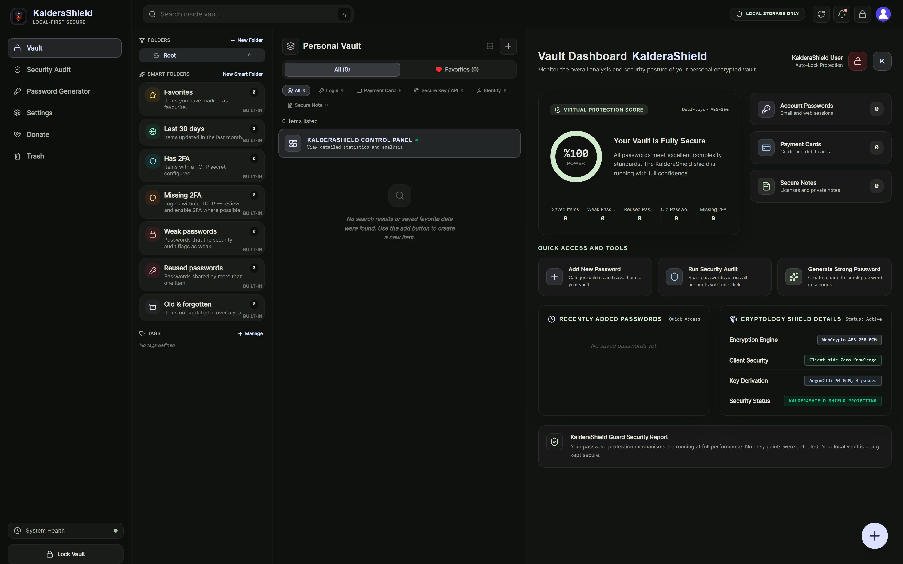

<div align="center">

# 🛡️ KalderaShield

**The Offline-First, Zero-Knowledge Security Vault & Password Manager**

*Enterprise-grade local cryptographic security for Desktop (Windows, Linux, macOS), Android, and WebExtensions.*

<br />



<sub>KalderaShield v7.0.20 — the vault workspace with smart folders, the security dashboard and live cryptography status. Regenerate with <code>node scripts/capture-app-screenshot.cjs</code>.</sub>

<br />

-brightgreen?style=flat-square&logo=shield)


[](https://www.bestpractices.dev/projects/14390)
[](https://scorecard.dev/viewer/?uri=github.com/hafgit99/kalderashield)
[](https://github.com/hafgit99/kalderashield/actions/workflows/codeql.yml)
[](https://github.com/hafgit99/kalderashield/actions/workflows/ci.yml)

[Features](#-key-features) • [Security Architecture](#-security-architecture) • [Security Review Status](#-security-review-and-external-audit-status) • [Platforms](#-platform-matrix) • [Build & Verification](#-build--verification) • [Documentation](#-documentation)

</div>

---

## 🌟 Overview

**KalderaShield** is a next-generation, local-first password manager engineered for complete data sovereignty. Built with **React 19, TypeScript, Rust (Tauri 2), WebCrypto, wa-sqlite (OPFS), and Manifest V3 WebExtensions**, KalderaShield guarantees that your master keys, credentials, notes, passkeys, and attachments remain strictly on your device under your complete control.

Unlike cloud-dependent password managers vulnerable to server breaches and key-escrow attacks, KalderaShield uses **at-rest field encryption**, **per-item HKDF key derivation**, **closed Shadow DOM UI isolation**, and **hardware-backed biometric protection**.

---

## 🛡️ Security Review and External Audit Status

KalderaShield publishes its threat model, security notes, quality gates, and a scope document prepared for a future independent assessment. **As of September 23, 2026, this repository does not publish a completed independent third-party security audit report.** The scope document is preparation material, not an audit result.

Earlier numerical scores and closure counts were maintainer assessments of older code snapshots. They are not independent ratings, certifications, or a current assessment of release `v7.0.20.0`; they are not presented here as evidence of external assurance. See [Security Review Status](docs/SECURITY_REVIEW_STATUS_2026.md) and the [External Audit Scope](docs/EXTERNAL_AUDIT_SCOPE_EN.md).

---

## ✨ Key Features

### 🔐 Zero-Knowledge Cryptography & Storage
- **Per-Item Key Isolation**: Every vault record (logins, payment cards, identities, secure notes, passkeys, attachments) is encrypted using a unique 256-bit AES-GCM key derived via WebCrypto HKDF-SHA256 (`salt = itemId`).
- **Argon2id KDF**: New vaults use runtime-specific profiles: Tauri native (desktop/Android) uses 64 MiB memory, 4 iterations, and 2 lanes; Web/WASM uses 32 MiB, 3 iterations, and 1 lane. KDF parameters are stored with vault metadata; existing vaults retain their recorded parameters.
- **At-Rest Field Masking**: Database rows in SQLite mask sensitive columns (`title`, `username_db`, `password_db`, `notes_db`) with static tokens (`[encrypted: aes-256-gcm]`). Metadata exists only within AES-256-GCM payloads.
- **Zero-Knowledge Emergency Recovery**: 24-word BIP-39 Recovery Key generation with offline recovery kit export.

### 🔌 Dynamic IPC & Browser Extension Companion
- **Dynamic TCP Port Probe & Discovery**: Native messaging IPC host dynamically probes ports `49155..=49165` (with fallback to OS ephemeral port) and writes active port to `KalderaShield_ipc_port.txt` in secure app data.
- **eTLD+1 Domain Matching**: Embedded **full Mozilla Public Suffix List** (10k+ rules with wildcard `*.ck` and exception `!www.ck` semantics, SHA-256-pinned snapshot) prevents credential leaks across shared hosting domains.
- **Closed Shadow DOM UI Isolation**: Extension autofill dropdowns, password generators, and phishing alerts render inside `<KalderaShield-autofill-host>` closed Shadow DOM boundaries, preventing host page JS tampering.
- **Scoped Extension Permissions**: Script matches narrowed strictly to `http://*/*` and `https://*/*`, excluding internal browser schemes (`chrome://`, `about:`).

### 📱 Android Native Hardware Protection
- **Hardware-Backed Biometrics**: AndroidKeyStore integration with WebAuthn PRF extension requirement for biometric unlock.
- **Encrypted Autofill Transport**: Credentials passed to `KalderaShieldAutofillService` use hardware AES-256-GCM encrypted `SecureTempFileStorage` + `FileProvider` URIs instead of plain Intent extras.
- **Multi-ABI Native Packaging**: Built with ABI splits supporting `arm64-v8a`, `armeabi-v7a`, and `x86_64`.
- **Screen Capture Protection**: `FLAG_SECURE` enforced across all Android activities and task switcher previews.

### 🔐 Hardware-Bound Unlock & Security Keys
- **Android — Hardware-Backed Keystore**: The biometric wrapping key is an auth-bound, non-exportable AndroidKeyStore key (user authentication required, invalidated by biometric re-enrollment). Unlock is authorized through **BiometricPrompt `CryptoObject`**, binding the OS auth token directly to the key's crypto operation.
- **Windows — TPM 2.0 via Windows Hello**: The WebAuthn PRF platform authenticator is TPM 2.0-backed — the PRF-derived wrapping key material never leaves the secure hardware boundary.
- **macOS — Secure Enclave via Touch ID**: Platform authenticator PRF output is sealed by the Secure Enclave.
- **🔑 YubiKey / FIDO2 Hardware Security Keys**: Cross-platform authenticators with PRF-capable firmware (e.g. **YubiKey 5, firmware 5.3+**) can act as the unlock factor — the vault credential is wrapped with a key derived **on the physical key itself**, so unlock requires its physical presence. Ideal for users who want a tangible, pocket-carried second factor.
- **Design invariant — hardware binding is a convenience layer**: Vault key derivation always remains **master password + Secret Key via Argon2id**. Device loss, TPM reset, or authenticator replacement degrades only convenience — never access to the vault. The vault file stays fully portable (sync, encrypted backups, sharing).

### 🌐 Internationalization (i18n)
Full localization across 12 languages:  
**Turkish (TR) • English (EN) • German (DE) • French (FR) • Spanish (ES) • Italian (IT) • Portuguese (PT) • Russian (RU) • Japanese (JA) • Chinese (ZH) • Korean (KO) • Arabic (AR)**.

---

## 💻 Platform Matrix

| Platform | Published Artifacts | Security Status |
|---|---|---|
| **Windows Desktop** | *Not published* — awaiting a code-signing certificate | 🔒 Build-verified (Tauri 2.11). Updater signature verification is implemented but inactive until Windows artifacts ship |
| **Linux Desktop** | AppImage, DEB | 🔒 Verified (PipeWire / D-Bus screen recording shield active, Tauri updater signatures verified) |
| **macOS Desktop** | *Not published* — awaiting Apple notarization | 🔒 Build-verified (Native WebExtension bridge) |
| **Android Mobile** | Signed APK, App Bundle (AAB) | 🔒 Verified (Multi-ABI, AndroidKeyStore, Autofill Service, FLAG_SECURE) |
| **Browser Extension** | Chrome (MV3 CRX), Firefox (XPI), Safari (WebExt) | 🔒 Verified (Closed Shadow DOM, 30s clipboard auto-clear, eTLD+1) |

**Why some rows have no artifacts.** v7.0.20 publishes Linux, Android and the
browser extensions only. The release pipeline fails closed on unsigned desktop
builds by design — `desktop:release:signing:report --require-signed` blocks the
job rather than letting an unverified `.exe` reach users (policy Y-19 in
[CODE_SIGNING_GUIDE_2026.md](docs/CODE_SIGNING_GUIDE_2026.md)). Windows and macOS
build and pass CI, but publishing them is gated on a code-signing certificate
and Apple notarization respectively. Support for both is implemented; neither
artifact list above is aspirational.

**RPM is not published.** `KalderaShield-7.0.20-1.x86_64.rpm.sig` is present on
the release without its `.rpm`, so the signature currently verifies nothing.
DEB and AppImage are the supported Linux packages; if RPM matters to you,
[open an issue](https://github.com/hafgit99/kalderashield/issues).

Check the [releases page](https://github.com/hafgit99/kalderashield/releases)
for the exact asset list of any given version, and `SHA256SUMS.txt` to verify a
download.

---

## 📊 Verification, Testing & Quality Gates

KalderaShield maintains rigorous automated testing standards with defense-in-depth verification spanning Unit Testing, Component Decomposition Suites, Property-Based Fuzz Testing, Mutation Testing, and Rust Native Test Harnesses.

### Test Metrics Summary

| Metric | Result | Status | Framework / Tool |
|---|---|---|---|
| **TypeScript Typecheck** | **`0 errors`** | ✅ 100% Clean | `tsc --noEmit` |
| **Unit & Integration Test Suite** | **`253 test files passed (253/253)`** | ✅ 100% Green | Vitest 4.1 |
| **Unit Tests Executed** | **`2,243 tests passed (2,243/2,243)`** | ✅ 100% Green | Vitest / React Testing Library |
| **Property-Based Fuzz Tests** | **`37 tests across 9 files passed`** | ✅ 100% Green | fast-check v4 |
| **End-to-End (E2E) Suites** | **`34 scenarios x 3 browsers = 102/102 passed`** | ✅ 100% Green | Playwright (Chromium, Firefox, WebKit) |
| **Mutation Testing** | **`8 specialized Stryker suites - 90.8% peak gate score`** | ✅ Measured & Gated | @stryker-mutator/core v9 |
| **Rust Backend Tests** | **`18 tests passed (18/18)`** | ✅ 100% Green | `cargo test` (Tauri 2) |
| **Lines Coverage** | **`91.12%`** | ✅ Exceeds Global Target (>= 90%) | Vitest V8 Coverage |
| **Statements Coverage** | **`89.56%`** | ✅ Exceeds Global Target (>= 88%) | Vitest V8 Coverage |
| **Functions Coverage** | **`88.98%`** | ✅ Exceeds Global Target (>= 85%) | Vitest V8 Coverage |
| **Branches Coverage** | **`82.18%`** | ✅ Exceeds Global Target (>= 80%) | Vitest V8 Coverage |

---

### 🎭 End-to-End (E2E) Cryptographic & Workflow Testing (`Playwright`)

Comprehensive browser-level integration testing verifies client-side zero-knowledge cryptography, SQLite persistence, and UI interaction states in real browser engines:

| E2E Feature Scenario | Target Flow & Security Verification | Status |
|---|---|---|
| **Payment Cards & Field Masking** | AES-256-GCM encryption of card numbers, CVV/PIN masking with unmask toggle, cardholder data persistence across reloads | ✅ 100% Passed |
| **Passkeys & WebAuthn Credentials** | Hardware passkey credential ID storage, service domain association, and detail panel rendering | ✅ 100% Passed |
| **Zero-Knowledge Share URLs** | Client-side ephemeral URL generation (`#share=...&k=...`), hash-fragment decryption, and one-click import into local vault | ✅ 100% Passed |
| **Custom Tagging & Categorization** | Dynamic multi-tag creation, visual chip indicators, and tag-based vault filtering | ✅ 100% Passed |
| **Theme & UI Preferences** | Dynamic palette switching (Emerald, Sapphire, Amber, Rose, etc.) and state persistence across full browser reloads | ✅ 100% Passed |

---

### 🌪️ Property-Based Fuzz Testing (`fast-check`)

Fuzz testing executes hundreds of randomized, property-bounded iterations per test run to uncover edge-case security failures, parser panics, encoding flaws, and ReDoS vulnerabilities:

| Fuzz Suite | Target Module | Security Boundaries Tested |
|---|---|---|
| `share.fuzz.test.ts` | `src/lib/share.ts` | Base64URL round-trips, AES-GCM share URLs, corrupted hash fragments, tampered payloads |
| `otp.fuzz.test.ts` | `src/lib/otp.ts` | Base32 decoding resilience, HMAC-SHA1/256/512, 6/7/8 digits, 15-300s period limits, URI parsing |
| `recoveryKey.fuzz.test.ts` | `src/lib/recoveryKey.ts` | 24-word BIP-39 phrase validity, 8-bit SHA-256 checksum detection, bit-flip mutant detection |
| `fuzzySearch.fuzz.test.ts` | `src/lib/fuzzySearch.ts` | Unicode normalization, diacritic stripping, Damerau-Levenshtein metric axioms, ReDoS safety |
| `backupValidation.fuzz.test.ts` | `src/lib/backupValidation.ts` | >100MB file size rejection, non-object JSON rejection, arbitrary object schema parsing |
| `encryption.fuzz.test.ts` | `src/lib/encryption.ts` | Arbitrary JSON envelopes, malformed KDF params, portable memory floor enforcement |
| `importer.fuzz.test.ts` | `src/lib/importer.ts` | CSV & Universal JSON round-trip import integrity, malformed array normalization |
| `attachments.fuzz.test.ts` | `src/lib/attachments.ts` | Non AES-256-GCM algorithms rejection, missing cryptographic metadata handling |

---

### 🧬 Mutation Testing (`Stryker Mutator`)

Mutation testing introduces deliberate faults (mutants) into source code to verify that the test suite actively detects and catches implementation regressions:

- **`stryker.security.conf.mjs`**: Tests `share.ts`, `recoveryKey.ts`, `backupValidation.ts`, `vaultDatabaseFormat.ts`
- **`stryker.search.conf.mjs`**: Tests `fuzzySearch.ts`, `recentSearches.ts`, `tags.ts`, `smartFolders.ts`
- **`stryker.conf.mjs` (Core)**: Tests `diceware.ts`, `emergencyKit.ts`, `otp.ts`, `random.ts`, `secretKey.ts`, `securityEvents.ts`
- **`stryker.storage.conf.mjs`**: Tests `desktopStorage.ts`, `secureStorage.ts`
- **`stryker.storage-orchestration.conf.mjs`**: Tests `storage.ts`
- **`stryker.storage-sqlite.conf.mjs`**: Tests `sqlite_opfs.ts`, `waSqliteVaultStorageRepository.ts`, `sqliteOpfsShared/Persistence/Migration/RowDecryptor.ts`
- **`stryker.importer.conf.mjs`**: Tests `importer.ts`
- **`stryker.importer-helpers.conf.mjs`**: Tests `csvParser.ts`, `fileDecoder.ts`

**Measured gate baselines** (full numbers in `docs/QUALITY_GATES.md`):

| Mutation Gate | Score | Mutants |
|---|---:|---:|
| Storage Bridges (`desktopStorage`, `secureStorage`) | **90.84%** | 131 |
| Importer Helpers (`csvParser`, `fileDecoder`) | **87.85%** | - |
| Security (`share`, `recoveryKey`, `backupValidation`, `vaultDatabaseFormat`) | **86.15%** | 533 |
| Storage Orchestration (`storage.ts`) | **88.43%** | - |
| SQLite OPFS Storage (`sqlite_opfs`, wa-sqlite repository, extracted layers) | **58.62%** | 1,638 |
| Core Crypto (`diceware`, `otp`, `random`, ...) | **81.74%** | - |
| Search & Smart Folders (`fuzzySearch`, `tags`, ...) | **81.33%** | 1,082 |
| Importer (`importer.ts`) | **80.35%** | - |

---

## 🚀 Quick Start & Building

### Prerequisites
- **Node.js**: `v20.x` or `v22.x` (or newer)
- **npm**: `v10.x` or newer
- **Rust**: Stable toolchain (`cargo`, `rustc` edition 2021)
- **Android SDK / NDK**: (For Android APK / AAB compilation)

### Installation

```bash
# Clone repository
git clone https://github.com/hafgit99/kalderashield.git
cd kalderashield

# Install dependencies
npm ci
```

### Verification & Testing

```bash
# ── 1. Typecheck ─────────────────────────────────────────────────
npm run typecheck

# ── 2. Unit Testing & Code Coverage ────────────────────────────────
npm run test:unit
npm run test:coverage

# ── 3. Property-Based Fuzz Testing ─────────────────────────────────
npm run test:fuzz

# ── 4. End-to-End (E2E) Browser Testing ────────────────────────────
# Run all E2E specs across Desktop & Mobile
npm run test:e2e

# Run E2E tests on Chromium only (fast smoke check)
npm run test:e2e:chromium

# ── 5. Mutation Testing (Stryker) ──────────────────────────────────
# Run Security modules mutation test
npm run test:mutation:security

# Run Search & Filtering modules mutation test
npm run test:mutation:search

# Run Core cryptographic modules mutation test
npm run test:mutation

# Run Storage modules mutation test
npm run test:mutation:storage

# Run SQLite OPFS storage core mutation test
npm run test:mutation:storage:sqlite

# Run Importer modules mutation test
npm run test:mutation:importer

# Dry-run mode for any mutation suite (instant test setup verification)
npm run test:mutation:security:dry
npm run test:mutation:search:dry

# ── 6. Native Rust Backend Tests ───────────────────────────────────
cd src-tauri && cargo test && cd ..
```

### Building Desktop Applications

```bash
# Build Tauri Desktop App (Current OS target)
npm run desktop:build

# Run Desktop Release Gate (18-step automated verification)
npm run desktop:release:gate

# Build Local Signed Desktop Release (Offline/Local CI fallback)
npm run release:local

# Generate Auto-Updater Manifest (release-local/updater/latest.json)
npm run release:updater:manifest
```

### Building Android Applications

```bash
# Build Multi-ABI Debug APK
npm run android:build:apk:debug:aarch64

# Build Production Release APK (Signed Release Candidate for ARM64 / aarch64)
npm run android:build:apk:aarch64

# Build Universal Release APK (All ABIs: arm64-v8a, armeabi-v7a, x86_64)
npm run android:build:apk

# Run Android Release Gate (18-step automated release candidate verification)
npm run android:release:gate

# Run Android Device Doctor & Security Diagnostics
npm run android:device:doctor
npm run android:device:smoke
```

### Building Browser Extensions

```bash
# Build Chrome & Firefox Extension (dist-extension/)
npm run build:extension

# Package Firefox XPI
npm run package:firefox:xpi
```

---

## 📚 Documentation Index

- 🏗️ [Architecture Review & System Boundaries](docs/ARCHITECTURE_REVIEW.md)
- 🛠️ [KalderaShield CLI Usage Guide](CLI_USAGE.md)
- 🔑 [Code Signing & Distribution Guide](docs/CODE_SIGNING_GUIDE_2026.md)
- 🤖 [Android Readiness & Hardware Security](docs/ANDROID_READINESS.md)
- 🦊 [Firefox XPI Packaging & AMO Guide](FIREFOX_XPI.md)
- 🍏 [Safari Manifest V3 Extension Guide](SAFARI_EXTENSION.md)

---

<div align="center">

**KalderaShield** • Built with ❤️ for Zero-Knowledge Security & Privacy.  
*Licensed under Apache License 2.0.*

</div>
